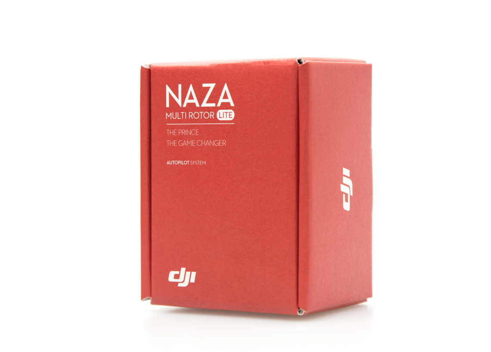

# drones
## Naza-M Lite
<ul class="pull-bottom"><li>All-in-One Design</li><li>Advanced attitude stabilize Algorithm</li><li>Multiple flight control mode/intelligent switching</li><li>GPS Module Available/Accurate Position hold</li><li>Intelligent Orientation Control (IOC)</li><li>Failsafe mode</li><li>Low voltage protection</li><li>Motor Arm and Motor Dis-arm</li><li>Support Futaba S-Bus and PPM receiver</li><li>Supported multi-rotor types</li><li>Built-in Gimbal stabilization function</li><li>Remote adjustment</li></ul>

hello
